# Five-IMU Full-Body Reconstruction with IMUCoCo and DTP

Real-time full-body pose reconstruction from five wearable IMUs mounted on the
torso, wrists, and ankles. The project receives BNO085 measurements over MQTT
or serial, calibrates and filters them, runs the official pretrained IMUCoCo
and DTP models, renders an SMPL/SMPL-H body, and records timestamped joint
angles.

> This repository is a five-sensor **runtime adaptation of pretrained models**.
> It does not claim that IMUCoCo or DTP was fine-tuned on this hardware layout.

## Highlights

- Five sensors: torso, left/right wrist, left/right ankle
- MQTT batch ingestion or direct serial input
- Host-aligned 20 Hz synchronization
- T-pose, gravity, bias, and noise calibration
- Quaternion validation, mounting correction, SLERP, EMA, and deadband filtering
- Online CUDA inference with recurrent hidden state
- SMPL-H animation and ten timestamped joint angles
- No dataset or model training required for live inference

## Full System Context

The supplied project-level diagram includes the wearable network, reconstruction
path, and an optional camera-based reference/evaluation path. The camera and web
application shown here are system context and are not implemented in this
runtime-only repository.

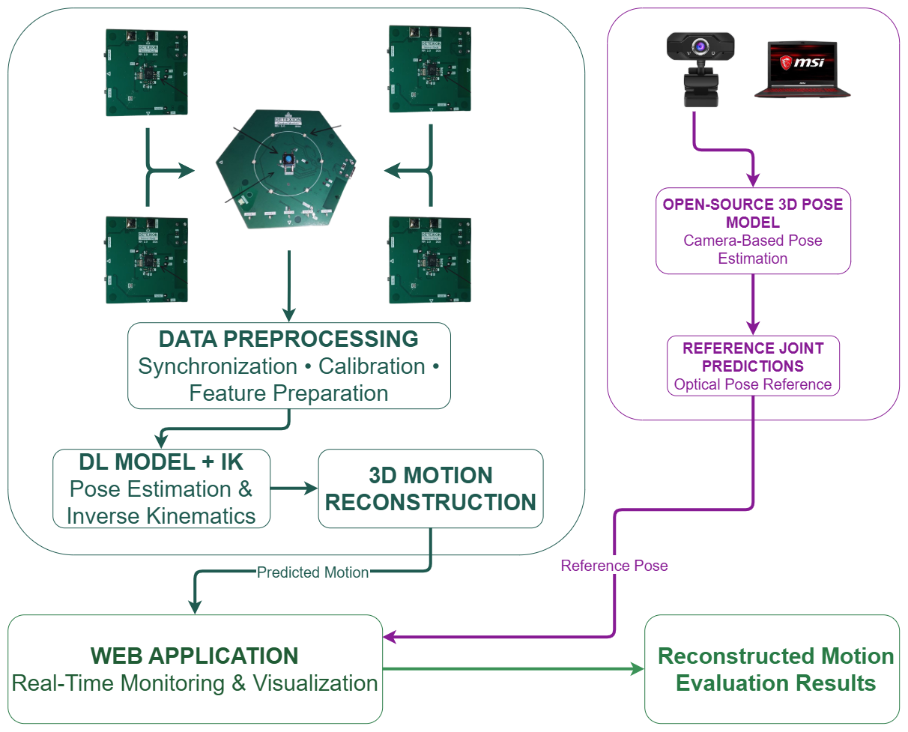

## Runtime Data Flow

```mermaid
flowchart LR
    A[5 BNO085 IMUs] --> B[ESP32 batch publisher]
    B -->|Wi-Fi / MQTT| C[MQTT broker]
    C --> D[Batch parser and five-node gate]
    A -->|Alternative| E[USB serial]
    D --> F[Compatibility bridge]
    E --> G[Packet validation]
    F --> G
    G --> H[Axis mapping and T-pose calibration]
    H --> I[Gravity, bias and noise removal]
    I --> J[SLERP and 20 Hz synchronization]
    J --> K[Five by nine model frame]
    K --> L[IMUCoCo]
    L --> M[DTP Poser]
    M --> N[SMPL kinematics]
    N --> O[SMPL-H mesh viewer]
    N --> P[Joint-angle CSV]
```

## Deep-Learning Flow

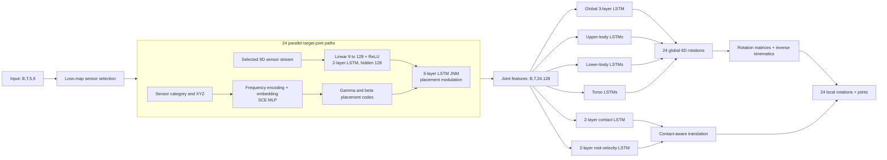

The editable Mermaid source is available in
[`docs/diagrams/deep-learning-flow.mmd`](docs/diagrams/deep-learning-flow.mmd).
See [`docs/ARCHITECTURE.md`](docs/ARCHITECTURE.md) for tensor shapes and module
responsibilities.

## Sensor Contract

| MQTT source | Node | Body location | SMPL vertex |
|---|---:|---|---:|
| `Center` | 0 | Torso | 3021 |
| `Node1` | 1 | Left wrist | 1961 |
| `Node2` | 2 | Right wrist | 5424 |
| `Node3` | 3 | Left ankle | 1176 |
| `Node4` | 4 | Right ankle | 4662 |

Each synchronized sensor contributes six orientation values and three global
linear-acceleration values. The online tensor is `[1,1,5,9]`. Gyroscope data
supports calibration and stationary detection but is not a model input channel.

## Repository Layout

```text
firmware/                 Included MQTT payload parser
scripts/                  MQTT, serial, visualization, and angle launchers
src/calibration/          Mounting, model-axis, and T-pose transforms
src/input/                Validation, filtering, and synchronization
src/models/               Online IMUCoCo/DTP runtime wrapper
src/visualization/        Non-blocking SMPL and SMPL-H viewers
third_party/IMUCoCo/      Minimal official GPL-3.0 inference source
tools/                    Checkpoint downloader and asset validator
docs/                     Architecture, data flow, and diagrams
tests/                    Asset-independent component tests
```

Datasets, virtual environments, output recordings, checkpoints, and licensed
body-model files are intentionally excluded.

## Setup

Tested with Python 3.10.13. On Windows with Miniconda:

```powershell
conda create -n fiveimu_pose python=3.10.13 pip -y
conda activate fiveimu_pose
cd D:\FiveIMU-IMUCoCo-DTP-Pipeline
pip install torch==2.9.0 torchvision torchaudio --index-url https://download.pytorch.org/whl/cu128
pip install --no-build-isolation chumpy==0.70
pip install -r requirements.txt
```

Use a PyTorch build compatible with the target GPU driver. Confirm CUDA:

```powershell
python scripts\verify_torch.py
```

Alternatively, create the base environment from `environment.yml`, then
install the matching PyTorch build and legacy Chumpy package using the two
special commands above.

## Required Assets

Download the three public upstream files:

```powershell
python tools\download_checkpoints.py
```

This creates:

```text
saved_checkpoints/imucoco_best.pth
saved_checkpoints/all_error_loss_map.pth
saved_checkpoints/poser_dtp_best.pth
```

Download SMPL under its own license and place `SMPL_MALE.pkl` in `smpl/`.
For SMPL-H rendering, place the neutral `model.npz` in `smplh/neutral/`.

```powershell
python tools\check_assets.py
```

The pose datasets used by the original research include AMASS, DIP-IMU,
TotalCapture, Xsens collections, and IMUCoCo. They are training/evaluation data
and are not needed for this pretrained live runtime.

## Run with MQTT

The default broker is `192.168.1.155:1883`, topic `FYP_IMU_Session/#`, and the
included parser is loaded from `firmware/`.

Full SMPL-H reconstruction with angles:

```powershell
python scripts\realtime_mqtt_with_angles.py --device cuda --visualize --mqtt-playback-mode catch-up --mqtt-max-buffer-ms 2000 --calibration-gyro-limit-deg 3
```

Use `--broker ADDRESS --mqtt-port PORT` for another broker. Use `paced` instead
of `catch-up` for evenly released frames at the cost of additional latency.

## Run with Serial

```powershell
python scripts\realtime.py --port COM3 --baudrate 921600 --device cuda --visualize --output-hz 20 --calibration-gyro-limit-deg 3
```

The serial stream must use the validated GlobalPose text packet contract
described in [`docs/DATA_PIPELINE.md`](docs/DATA_PIPELINE.md).

## Outputs

Runs create ignored files under `experiments/`:

- `filtered_input_*.csv`: exact synchronized model inputs
- `prediction_*.csv`: rotations, translation, and latency
- `calibration_*.json`: per-sensor bias, noise, deadband, and restart data
- `joint_angles_*.csv`: timestamped shoulder, elbow, hip, knee, and ankle angles

## Full-System Live Test Results

The following results were captured during one live five-IMU system run and
compared frame-by-frame with synchronized motion-capture joint angles. They
demonstrate the complete path from wearable sensors through MQTT, preprocessing,
IMUCoCo/DTP inference, SMPL-H reconstruction, and ground-truth comparison.

The interface reports angular errors in degrees. Its per-joint percentage is a
custom relative-angle agreement score:

```text
agreement = max(0, 1 - |predicted - mocap| / |mocap|) * 100%
```

This percentage should not be confused with classification accuracy. The
weighted error uses the interface's joint-group weights: hip 0.279, shoulder
0.279, knee 0.169, ankle 0.103, and elbow 0.169.

| Captured frame | Pose | Weighted error | All-joint RMSE | Ground-truth age |
|---:|---|---:|---:|---:|
| 3406 | T-pose | 8.667 deg | 9.248 deg | 15 ms |
| 3573 | Arms raised | 13.275 deg | 14.302 deg | 94 ms |
| 4022 | Asymmetric arms | 18.298 deg | 21.962 deg | 32 ms |
| 4233 | Arms lowered | 24.013 deg | 27.547 deg | 62 ms |
| 4687 | Raised arms with lean | 31.320 deg | 39.643 deg | 47 ms |
| 5360 | Knee lift | 21.945 deg | 28.087 deg | 16 ms |
| 5517 | Near-neutral stance | 7.013 deg | 9.477 deg | 79 ms |
| 5799 | Asymmetric stance | 17.155 deg | 22.144 deg | 63 ms |
| 6216 | Leaning stance | 10.677 deg | 12.877 deg | 31 ms |
| 6468 | Side leg lift | 17.096 deg | 21.266 deg | 47 ms |
| 6694 | Cross-leg pose | 12.253 deg | 14.365 deg | 63 ms |

Across these 11 selected frames, the observed mean weighted angular error was
**16.519 deg** and the mean all-joint RMSE was **20.083 deg**. Weighted error
ranged from **7.013 deg to 31.320 deg**, while RMSE ranged from **9.248 deg to
39.643 deg**. Ground-truth age averaged **49.9 ms** and ranged from 15 to 94 ms.

For example, frame 3406 reported left/right knee agreement of **99.7%/100.0%**,
ankle agreement of **92.9%/96.7%**, elbow agreement of **96.7%/90.3%**, hip
agreement of **92.6%/94.9%**, and shoulder agreement of **85.8%/87.9%**. The
more difficult raised-arm and single-leg poses show the expected degradation
from sparse sensing, calibration error, temporal mismatch, and joints without
directly attached IMUs.

These are illustrative frames selected from a live run, not aggregate results
over an independently held-out test set. A publication-quality accuracy claim
should be calculated from every synchronized frame and should report the test
protocol, participant split, calibration procedure, and confidence intervals.

<details>
<summary><strong>Open the complete 11-frame live-result gallery</strong></summary>

| T-pose, frame 3406 | Arms raised, frame 3573 |
|---|---|
| 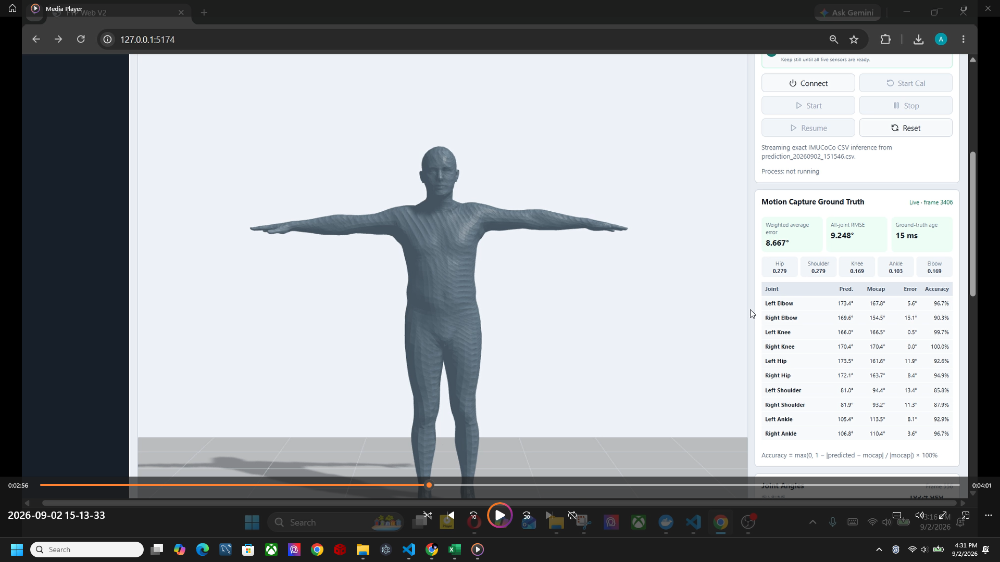 | 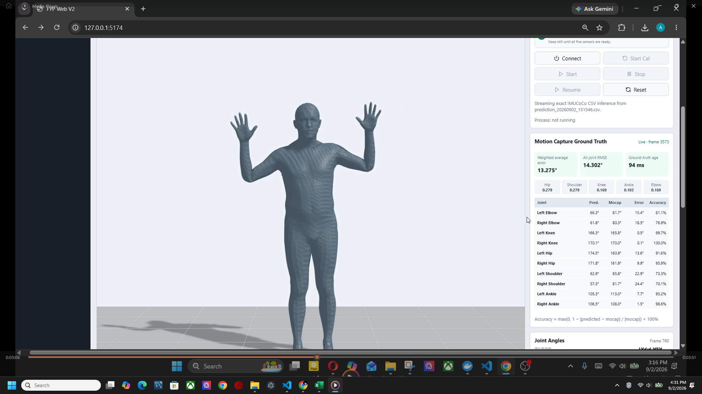 |

| Asymmetric arms, frame 4022 | Arms lowered, frame 4233 |
|---|---|
| 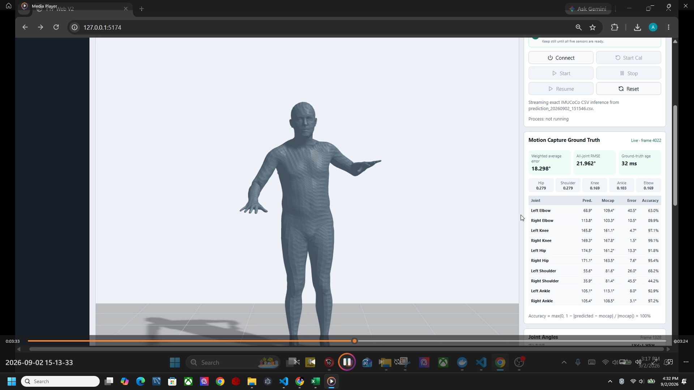 | 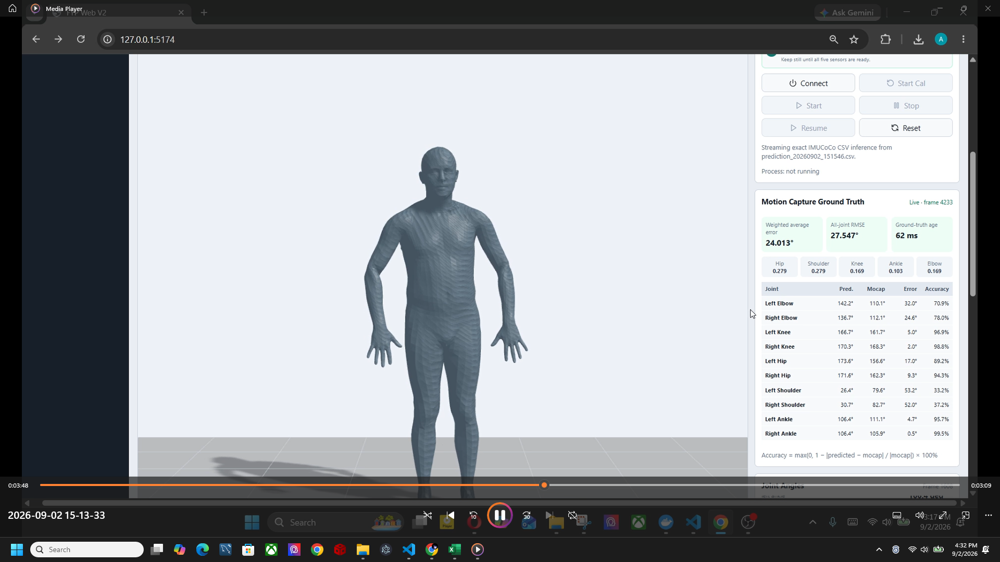 |

| Raised arms with lean, frame 4687 | Knee lift, frame 5360 |
|---|---|
| 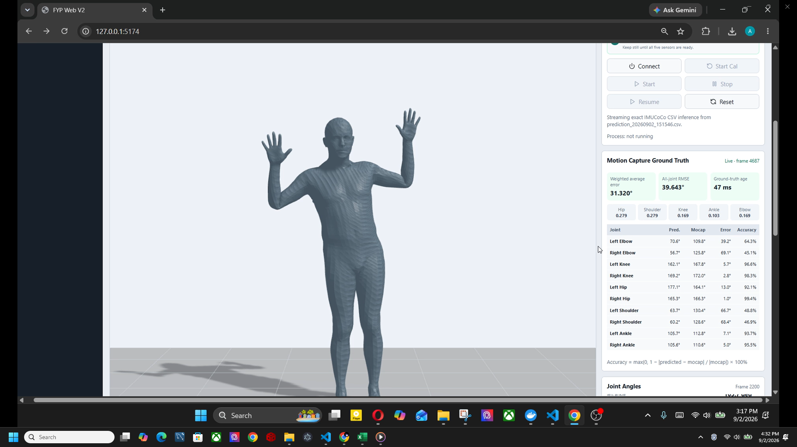 | 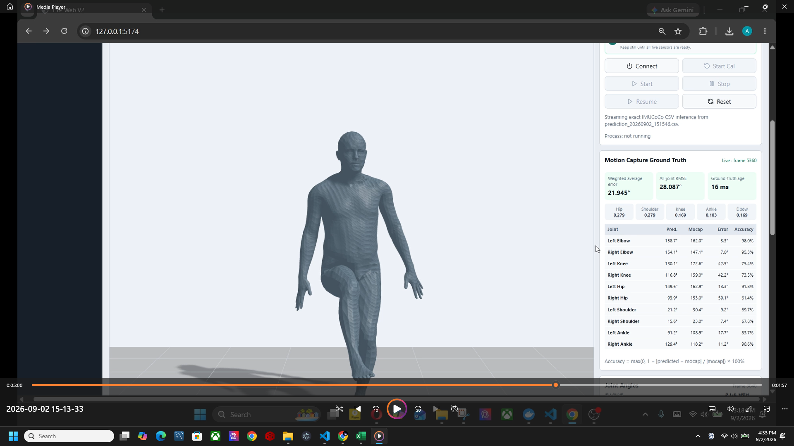 |

| Near-neutral stance, frame 5517 | Asymmetric stance, frame 5799 |
|---|---|
| 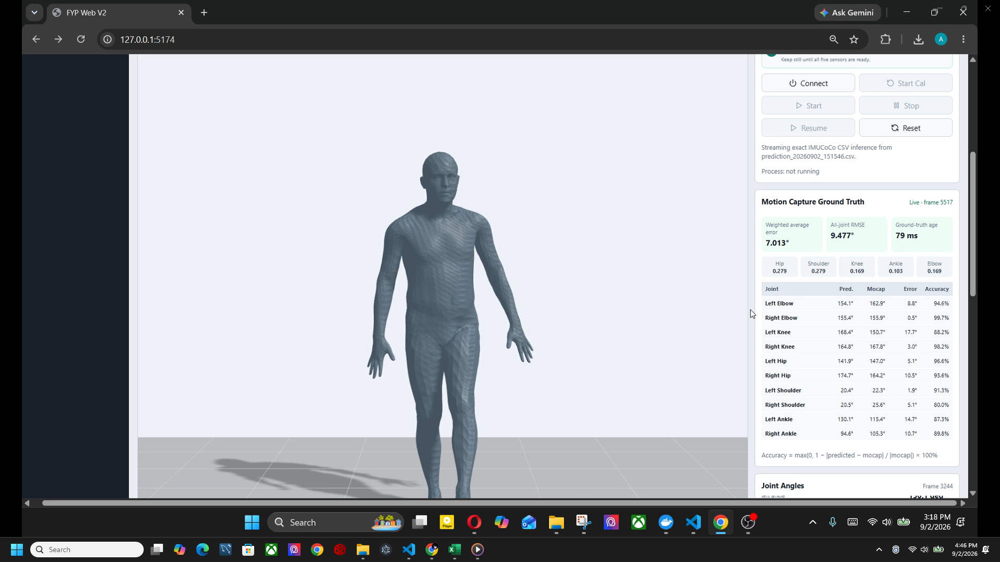 | 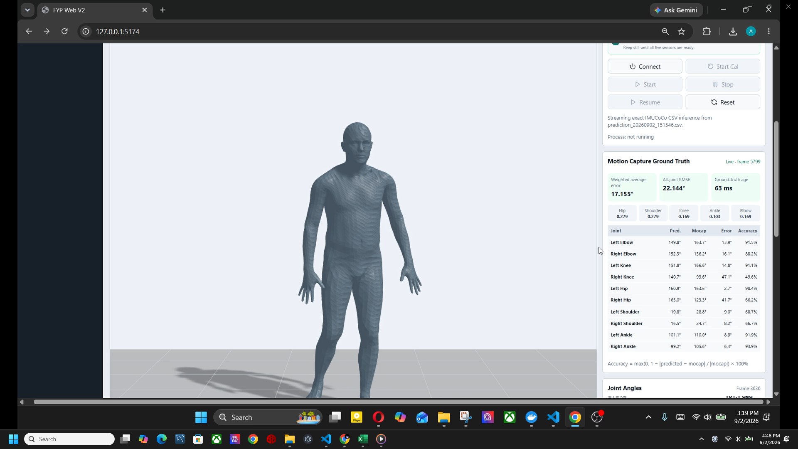 |

| Leaning stance, frame 6216 | Side leg lift, frame 6468 |
|---|---|
| 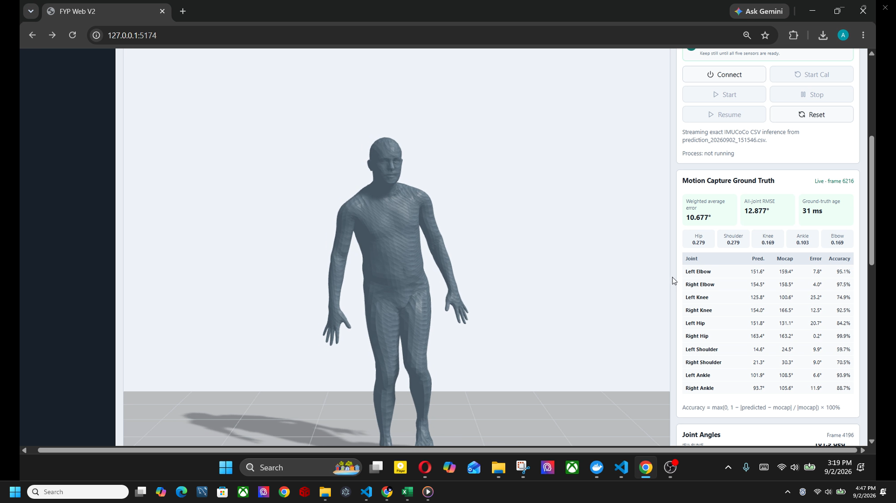 | 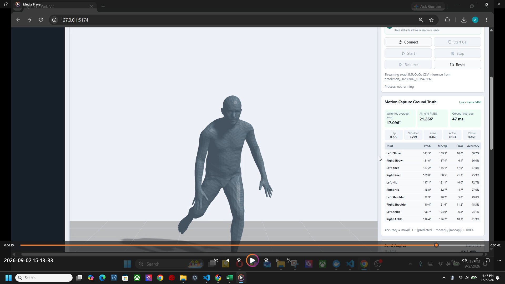 |

| Cross-leg pose, frame 6694 |
|---|
| 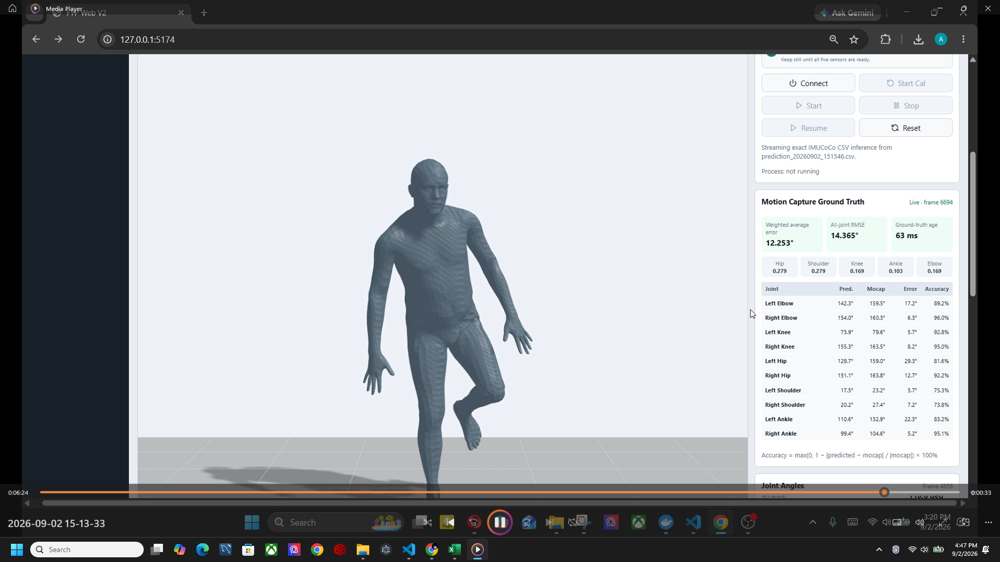 |

</details>

## Testing

```powershell
python -m pytest -q
```

## Limitations

- Five sensors leave pose ambiguity, especially at elbows, hips, and knees.
- Output quality depends strongly on axis mapping and a motionless calibration.
- SMPL-H fingers remain neutral because no finger motion is predicted.
- `catch-up` mode minimizes backlog but can display batch-to-batch jumps.
- The included runtime is pretrained/zero-shot, not subject-specific fine-tuning.

## Attribution and License

The included IMUCoCo source is derived from the official UIST 2025 project by
Haozhe Zhou, Riku Arakawa, Yuvraj Agarwal, and Mayank Goel and is licensed under
GPL-3.0. See [`THIRD_PARTY_NOTICES.md`](THIRD_PARTY_NOTICES.md) and `LICENSE`.

When using the upstream work, cite:

```bibtex
@inproceedings{zhou2025imucoco,
  title={IMUCoCo: Enabling Flexible On-Body IMU Placement for Human Pose Estimation and Activity Recognition},
  author={Zhou, Haozhe and Arakawa, Riku and Agarwal, Yuvraj and Goel, Mayank},
  booktitle={Proceedings of the 38th Annual ACM Symposium on User Interface Software and Technology},
  pages={1--16},
  year={2025},
  publisher={ACM},
  doi={10.1145/3746059.3747695}
}
```
